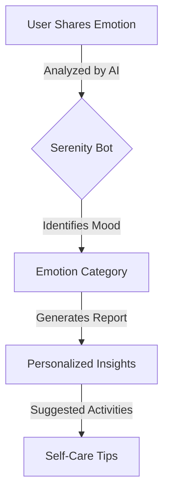
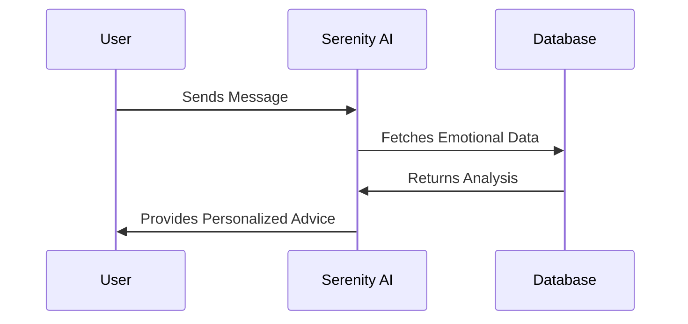

## 🧘‍♂️ **Serenity - AI Mental Health Chatbot**  
*A Compassionate AI-Powered Companion for Mental Well-Being*  

  

---

## 🌟 **Introduction**  
**Serenity** is an advanced AI-powered **mental health chatbot** designed to provide compassionate and personalized support. Whether you're feeling stressed, anxious, or simply need someone to talk to, **Serenity** is here to listen, understand, and guide you toward mental well-being.  

### 💡 **Why Serenity?**  
✅ **Emotionally Intelligent** – Understands and responds to emotions in real time.  
✅ **Personalized Guidance** – Offers tailored self-care suggestions based on your mood.  
✅ **Always Available** – No appointments, no judgment—just support when you need it.  

---

## 🚀 **Key Features**  

### 🎭 **1. Emotion Analysis & Mood Tracking**  
Serenity uses **Natural Language Processing (NLP)** to analyze your emotions and track mood patterns over time.  

📊 **Mood Charts & Reports** – Visual representation of your emotional journey.  
🤖 **AI-Powered Analysis** – Detects stress, anxiety, happiness, or loneliness.  

  

---

### 🗣 **2. Multi-Modal Communication**  
💬 **Text & Voice Support** – Talk to Serenity using text or voice.  
⚡ **Adaptive AI** – Understands different tones and phrases seamlessly.  

---

### 🎯 **3. Personalized Self-Care Suggestions**  
Based on your emotions, Serenity provides actionable insights:  

✔️ **Breathing exercises** for stress relief 🧘‍♂️  
✔️ **Journaling prompts** for self-reflection 📖  
✔️ **Mood-boosting activities** like music & meditation 🎶  

---

### 🎉 **4. Positive Reinforcement & Encouragement**  
🔹 Keeps you motivated with uplifting messages.  
🔹 Tracks your emotional progress and celebrates achievements.  

---

### 📊 **5. Data-Driven Insights**  
Serenity generates **comprehensive reports** with trends and emotional triggers.  

📈 **Your Emotional Journey at a Glance**  



---

## 🛠 **Tech Stack**  

| **Component**  | **Technology**  |
|---------------|---------------|
| **Frontend**  | React (Vite) + Tailwind CSS |
| **Animations** | Framer-Motion + GSAP |
| **Backend** | Node.js + Express.js |
| **Database** | MongoDB |
| **AI Engine** | Google Gemini API |

---

## 📂 **Project Structure**  

```bash
Serenity-AI-Chatbot/
│── backend/
│   ├── server.js
│   ├── package.json
│── frontend/
│   ├── src/
│   │   ├── components/
│   │   │   ├── Chat.jsx
│   │   │   ├── MoodChart.jsx
│   │   │   ├── Navbar.jsx
│   │   ├── App.jsx
│   ├── package.json
│── README.md
```

---

## 🎬 **Getting Started**  

### 🔧 **Backend Setup**  
```bash
cd backend
npm install
npm start
```

### 🖥 **Frontend Setup**  
```bash
cd frontend
npm install
npm run dev
```

---

## 🎯 **How It Works**  



---

## 📸 **Screenshots**  

### 🔹 AI Chat Interface  
  

### 🔹 Emotion Tracking Dashboard  
  

---

## 🎭 **Contribute**  
🤝 Want to enhance Serenity? Follow these steps:  

1️⃣ Fork the repository  
2️⃣ Create a new branch: `git checkout -b feature-name`  
3️⃣ Commit your changes: `git commit -m "Added feature XYZ"`  
4️⃣ Push to branch: `git push origin feature-name`  
5️⃣ Open a Pull Request  

---

## 📜 **License**  
This project is licensed under the **MIT License**.  

---

## 📞 **Contact & Support**  
For queries and support, reach out:  
📧 Email: [raj12@example.com](mailto:raj12@example.com)  
🔗 GitHub: [Rajeev12R](https://github.com/Rajeev12R)  

🚀 **Let’s revolutionize mental health care with AI!** 💙Here's a well-styled, professional **README.md** for your **Serenity - AI Mental Health Chatbot** with visually appealing formatting, diagrams, and flowcharts. It follows modern documentation trends, making it engaging and easy to read.  

Let me know if you want any modifications! 🚀  

---

### 🧘‍♂️ **Serenity - AI Mental Health Chatbot**  
*A Compassionate AI-Powered Companion for Mental Well-Being*  

  

---

## 🌟 **Introduction**  
**Serenity** is an advanced AI-powered **mental health chatbot** designed to provide compassionate and personalized support. Whether you're feeling stressed, anxious, or simply need someone to talk to, **Serenity** is here to listen, understand, and guide you toward mental well-being.  

### 💡 **Why Serenity?**  
✅ **Emotionally Intelligent** – Understands and responds to emotions in real time.  
✅ **Personalized Guidance** – Offers tailored self-care suggestions based on your mood.  
✅ **Always Available** – No appointments, no judgment—just support when you need it.  

---

## 🚀 **Key Features**  

### 🎭 **1. Emotion Analysis & Mood Tracking**  
Serenity uses **Natural Language Processing (NLP)** to analyze your emotions and track mood patterns over time.  

📊 **Mood Charts & Reports** – Visual representation of your emotional journey.  
🤖 **AI-Powered Analysis** – Detects stress, anxiety, happiness, or loneliness.  

  

---

### 🗣 **2. Multi-Modal Communication**  
💬 **Text & Voice Support** – Talk to Serenity using text or voice.  
⚡ **Adaptive AI** – Understands different tones and phrases seamlessly.  

---

### 🎯 **3. Personalized Self-Care Suggestions**  
Based on your emotions, Serenity provides actionable insights:  

✔️ **Breathing exercises** for stress relief 🧘‍♂️  
✔️ **Journaling prompts** for self-reflection 📖  
✔️ **Mood-boosting activities** like music & meditation 🎶  

---

### 🎉 **4. Positive Reinforcement & Encouragement**  
🔹 Keeps you motivated with uplifting messages.  
🔹 Tracks your emotional progress and celebrates achievements.  

---

### 📊 **5. Data-Driven Insights**  
Serenity generates **comprehensive reports** with trends and emotional triggers.  

📈 **Your Emotional Journey at a Glance**  


---

## 🛠 **Tech Stack**  

| **Component**  | **Technology**  |
|---------------|---------------|
| **Frontend**  | React (Vite) + Tailwind CSS |
| **Animations** | Framer-Motion + GSAP |
| **Backend** | Node.js + Express.js |
| **Database** | MongoDB |
| **AI Engine** | Google Gemini API |

---

## 📂 **Project Structure**  

```bash
Serenity-AI-Chatbot/
│── backend/
│   ├── server.js
│   ├── package.json
│── frontend/
│   ├── src/
│   │   ├── components/
│   │   │   ├── Chat.jsx
│   │   │   ├── MoodChart.jsx
│   │   │   ├── Navbar.jsx
│   │   ├── App.jsx
│   ├── package.json
│── README.md
```

---

## 🎬 **Getting Started**  

### 🔧 **Backend Setup**  
```bash
cd backend
npm install
npm start
```

### 🖥 **Frontend Setup**  
```bash
cd frontend
npm install
npm run dev
```

---

## 🎯 **How It Works**  


---

## 📸 **Screenshots**  

### 🔹 AI Chat Interface  
  

### 🔹 Emotion Tracking Dashboard  
  

---

## 🎭 **Contribute**  
🤝 Want to enhance Serenity? Follow these steps:  

1️⃣ Fork the repository  
2️⃣ Create a new branch: `git checkout -b feature-name`  
3️⃣ Commit your changes: `git commit -m "Added feature XYZ"`  
4️⃣ Push to branch: `git push origin feature-name`  
5️⃣ Open a Pull Request  

---

## 📜 **License**  
This project is licensed under the **MIT License**.  

---

## 📞 **Contact & Support**  
For queries and support, reach out:  
📧 Email: [rjranjan2112@gmail.com](mailto:rjranjan2112.com)  
🔗 GitHub: [Rajeev12R](https://github.com/Rajeev12R)  

🚀 **Let’s revolutionize mental health care with AI!** 💙